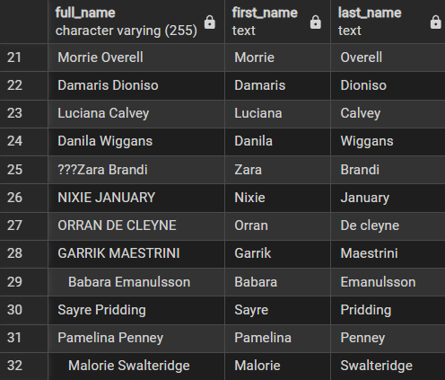
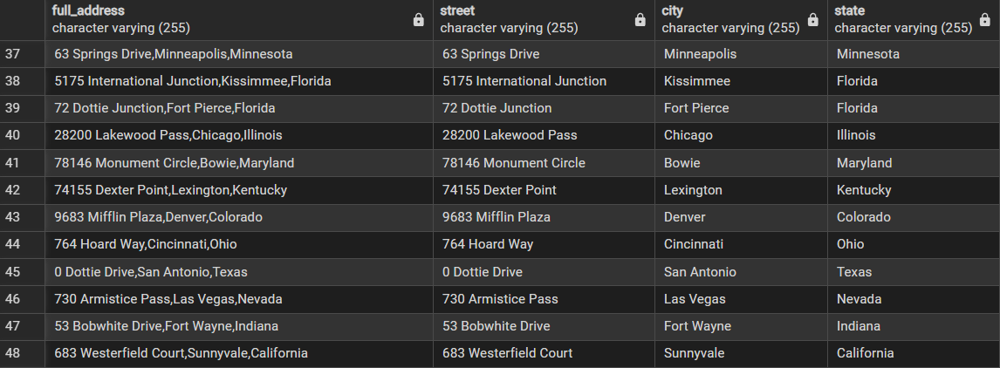
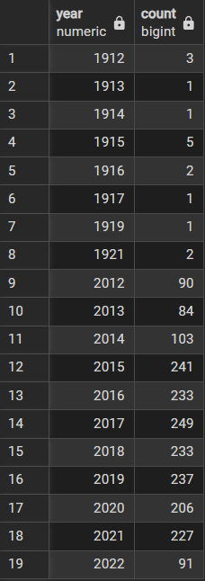

# 🧹 Club Members Data Cleaning Project (PostgreSQL)


A robust data cleaning pipeline implemented entirely in **PostgreSQL** that transforms raw club membership data into analysis-ready structured format. Features advanced SQL techniques for handling real-world data quality issues.

## 📁 Repository Structure
- [club_member_info.csv](club_member_info.csv) – Raw dataset before cleaning  
  
- [club_members_info_final.csv](club_members_info_final.csv) – Cleaned dataset  
  
- [sql_script.sql](sql_script.sql) – SQL Script

## 🔍 Key Features
- **PostgreSQL implementation**
- Multi-stage staging table strategy
- Advanced string manipulation and pattern matching
- Century correction for historical dates
- Job title standardization hierarchy using CASE expressions
- Job title standardization hierarchy
- Phone number validation framework
- Deduplication with window functions

## 🛠️ Data Cleaning Steps

### 1. Schema Refactoring

```sql
-- Add SURROGATE KEY with IDENTITY
ALTER TABLE members
ADD member_id BIGINT GENERATED ALWAYS AS IDENTITY;

-- Create staging tables
CREATE TABLE stage1 AS SELECT * FROM raw_members;
```

### 2. Name Standardization

```sql
UPDATE stage1
SET full_name = REGEXP_REPLACE(
TRIM(REGEXP_REPLACE(full_name, '^?+', '')),
'[^a-zA-Z- ]',
'',
'g'
);

-- Split names with lookahead for suffixes
ALTER TABLE stage2 ADD COLUMN first_name VARCHAR(255);
ALTER TABLE stage2 ADD COLUMN last_name VARCHAR(255);

UPDATE stage2 SET
first_name = SPLIT_PART(full_name, ' ', 1),
last_name = SUBSTRING(full_name FROM POSITION(' ' IN full_name)+1);
```
 

### 3. Address Parsing
``` sql
WITH split_addr AS (
SELECT
member_id,
SPLIT_PART(full_address, ',', 1) AS street,
TRIM(SPLIT_PART(full_address, ',', 2)) AS city,
CASE
WHEN SPLIT_PART(full_address, ',', 3) = 'Tej+F823as' THEN 'Texas'
ELSE TRIM(SPLIT_PART(full_address, ',', 3))
END AS state
FROM stage2
)
UPDATE stage3
SET street = split_addr.street,
city = split_addr.city,
state = split_addr.state;
```
 
### 4. Temporal Data Correction
```sql
-- Fix 2-digit years spanning centuries
UPDATE stage4
SET membership_date =
CASE
WHEN EXTRACT(YEAR FROM membership_date) BETWEEN 00 AND 20
THEN membership_date + INTERVAL '100 years'
ELSE membership_date
END;

-- Validate date ranges
ALTER TABLE stage4 ADD CONSTRAINT valid_dates
CHECK (membership_date BETWEEN '1900-01-01' AND CURRENT_DATE);

```
###  Raw Data Year Distribution 
 

### Cleaned Year Distribution


### 5. Deduplication Strategy
```sql
WITH duplicates AS (
SELECT member_id,
ROW_NUMBER() OVER(
PARTITION BY first_name, last_name, email, phone
ORDER BY membership_date DESC
) AS rn
FROM final_stage
)
DELETE FROM final_stage
WHERE member_id IN (
SELECT member_id FROM duplicates WHERE rn > 1
);
```
### 6. Job Title Standardization

``` sql
UPDATE cmi_staging3
SET job_title = CASE
WHEN array_length(string_to_array(trim(job_title), ' '), 1) > 1
AND lower(split_part(job_title, ' ', array_length(string_to_array(trim(job_title), ' '), 1))) = 'i'
THEN replace(lower(job_title), ' i', ', level 1')
WHEN array_length(string_to_array(trim(job_title), ' '), 1) > 1 
     AND lower(split_part(job_title, ' ', array_length(string_to_array(trim(job_title), ' '), 1))) = 'ii'
THEN replace(lower(job_title), ' ii', ', level 2')

WHEN array_length(string_to_array(trim(job_title), ' '), 1) > 1 
     AND lower(split_part(job_title, ' ', array_length(string_to_array(trim(job_title), ' '), 1))) = 'iii'
THEN replace(lower(job_title), ' iii', ', level 3')

WHEN array_length(string_to_array(trim(job_title), ' '), 1) > 1 
     AND lower(split_part(job_title, ' ', array_length(string_to_array(trim(job_title), ' '), 1))) = 'iv'
THEN replace(lower(job_title), ' iv', ', level 4')

ELSE trim(lower(job_title))
```


## 📊 Data Analysis Queries (PostgreSQL)

After cleaning, the following SQL queries were used to analyze the club members dataset and validate the results. These examples showcase typical exploratory and summary queries you can run on the cleaned data.

---

### 1. **Count Total Cleaned Records**
``` sql
SELECT COUNT(*) AS total_members
FROM cmi_staging4;
```


### 2. **Distribution of Marital Status**

```  sql
SELECT martial_status, COUNT(*) AS count
FROM cmi_staging3
GROUP BY martial_status
ORDER BY count DESC;
```


### 3. **State Frequency and Outlier Detection**
``` sql
SELECT DISTINCT state, COUNT(*) AS count
FROM cmi_staging4
GROUP BY state
ORDER BY count DESC;
```


### 4. **Age Distribution**

``` sql
SELECT age, COUNT(*) AS count
FROM cmi_staging4
GROUP BY age
ORDER BY age;
```

### 5. **Membership Year Distribution**

```sql
SELECT EXTRACT(YEAR FROM membership_date) AS year, COUNT(*) AS count
FROM cmi_staging4
GROUP BY year
ORDER BY year;
```


